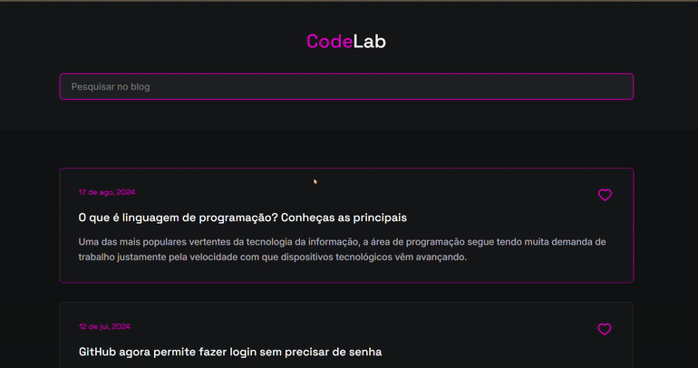

Blog com Busca

✨ Projeto de blog simples com funcionalidade de busca. Permite ao usuário digitar uma palavra e encontrar os posts que têm essa palavra no título.

---

  

---

⚙️Recursos

 - Busca por título de post.
 - Destaque dos posts que correspondem à pesquisa.
 - Favoritar posts clicando no ícone de coração.

---

🪛 Funcionalidades

 - Digitar palavras-chave no campo de busca.
 - Mostrar apenas os posts que correspondem à pesquisa.
 - Favoritar posts interativamente.

---

🌟 Tecnologias

 - HTML5
 - CSS3
 - JavaScript (ES6)

   
